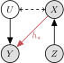
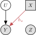
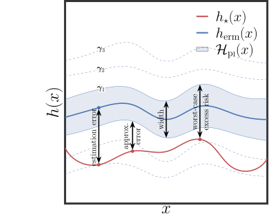
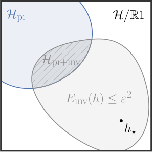
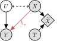
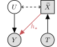
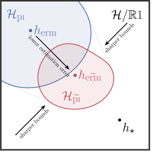
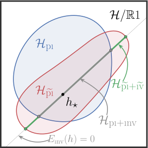
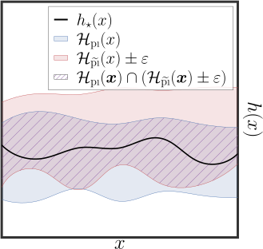

# Motivation

## Smoking and lung cancer (1950s)

::: {.columns}
::: {.column width="58%"}
**Strong association:** smokers had ~9× the risk of lung cancer. [Causal?]{.alert}

{fig-alt="Smoking causes cancer" width=48%}

::: {.fragment}
Not everyone agreed:

{fig-alt="A common cause explains both smoking and cancer" width=48%}
:::
:::
::: {.column width="42%"}
::: {.fragment}
{fig-alt="Ronald Fisher" width=85%}

<small>"…it is more likely that a ***common cause*** supplies the explanation… The obvious common cause to think of is the ***genotype***." — R. A. Fisher [-@fisher1958]</small>
:::
:::
:::

::: {.fragment}
[Observational data alone cannot tell the two models apart.]{.highlight}
:::

## How strong would confounding need to be?

::: {.columns}
::: {.column width="58%"}
Suppose Fisher were right: then the hidden factor must explain *all* of the association.

::: {.fragment}
If no confounder that strong is plausible, the effect must be causal:

{fig-alt="Causal effect plus bounded confounding" width=48%}
:::

::: {.fragment}
**Sensitivity analysis:** bound the confounding by $\gamma$; report every effect still consistent with the data.
:::
:::
::: {.column width="42%"}
{fig-alt="Jerome Cornfield" width=70%}

<small>"…if cigarette smokers have 9 times the risk of nonsmokers… and this is not because cigarette smoke is a causal agent… then the proportion of hormone-X-producers among cigarette smokers must be ***at least 9 times greater*** than that of nonsmokers." — Cornfield et al. [-@cornfield1959]</small>

<small style="opacity:0.6">Backstory adapted from @cinelli2019.</small>
:::
:::

# Partial Identification

## Hidden confounding hides the causal effect

::: {.columns}
::: {.column width="55%"}
Treatment $X$, outcome $Y$, hidden confounder $U$:
$$
Y = \hstar(X) + U + \xi ,
\qquad
\E{U} = \E{\xi} = 0 .
$$

::: {.fragment}
We want $\hstar(\vx)$, the effect of $\doo{X = \vx}$. But $U$ is unobserved, so many data-generating processes (DGPs) fit $p_{XYZ}$ equally well.
:::
:::
::: {.column width="45%"}
{fig-alt="Hidden confounding model" width=52%} {fig-alt="Intervention do(x)" width=40%}
:::
:::

## Partial identification: bounds instead of a point

::: {.columns}
::: {.column width="50%"}
Keep *every* DGP $q$ consistent with the data and assumptions $\Ppi^{\gamma}$:
$$
\Hpi(\vx) = \Big[ \min_{q \in \Qpi} h^q_{\star}(\vx),\; \max_{q \in \Qpi} h^q_{\star}(\vx) \Big]
$$
:::
::: {.column width="50%"}
{fig-alt="PI interval at a query point" width=62%}
:::
:::

::: {.incremental}
- **Valid** if the assumptions hold: $\hstar \in \Hpi$.
- [Problem:]{.alert} bounds are only as tight as the assumptions: often near-vacuous, unless we encode *all* credible domain knowledge.
:::

## This work

 

> Can **known data symmetries**, i.e. transformations $\sT$ that leave the causal effect unchanged,
> $$\hstar(\tau \vx) = \hstar(\vx) \quad \forall\, \tau \in \sT,$$
> serve as a new source of constraints that **provably sharpen** PI bounds?

::: {.incremental}
- A rotated cat is still a cat.
- Scaling all prices and income by inflation leaves demand unchanged.
- Symmetries are widely known, yet underused for partial identification.
:::

# Symmetry-Informed Bounds

## Route 1: invariance as a shape constraint

::: {.columns}
::: {.column width="62%"}
Add the symmetry to the solver as a constraint, with $\eps$ as a sensitivity parameter:
$$
\Einv(h) := \E{ \big| h(X) - h(\tau X) \big|^2 } \leq \eps^2 .
$$

::: {.fragment}
This gives the sharp set $\HpiInv = \Hpi \cap \Hinv^{\eps}$.
:::

::: {.fragment}
[But:]{.alert} it needs white-box access to the solver, and non-convex invariance constraints can be unstable on high-dimensional data.
:::
:::
::: {.column width="38%"}
{fig-alt="Invariance-constrained identified set" width=100%}
:::
:::

## Route 2: data augmentation is a soft intervention

::: {.columns}
::: {.column width="55%"}
Leave the solver alone; change the *data* instead, with $\tX := \tau X$, $\tau \sim p_{\sT}$:
$$
\QpiDA(p_{XYZ}) := \Qpi(p_{\tX YZ}) .
$$

::: {.incremental}
- For $\sT$-invariant $\hstar$: $Y = \hstar(\tX) + U + \xi$. Same mechanism, same graph.
- Confounding is **diluted**: $\tau$ is exogenous by construction.
- So existing PI assumptions **stay valid** after DA, for off-the-shelf and black-box solvers.
:::
:::
::: {.column width="45%"}
::: {.columns}
::: {.column width="50%"}
{fig-alt="Data augmentation graph" width=100%}
:::
::: {.column width="50%"}
{fig-alt="Soft-intervention graph" width=100%}
:::
:::
:::
:::

## Why does DA sharpen bounds?

::: {.columns}
::: {.column width="62%"}
PI uncertainty is an **attribution problem**: how much of the $(X, Y)$ covariation is due to $\hstar$, and how much to $U$?

::: {.fragment}
Only variation with a *known* relation to $U$ can break the tie, like a strong instrument. DA adds exactly such variation.
:::

::: {.fragment}
Bounds shrink when the added variance outweighs the induced mean shift:
$$
\Omega := \rho \cdot \big[\, \underbrace{\tr{\varShift}}_{\text{lever}} + \underbrace{D^2_{\mathcal{B}}(p_X, p_{\tX})}_{\text{penalty}} \,\big] / k \;\leq\; 1 .
$$
All terms are **observable**.
:::
:::
::: {.column width="38%"}
{fig-alt="Post-DA identified set" width=100%}
:::
:::

## Guarantees, and a safeguard

::: {.columns}
::: {.column width="58%"}
{fig-alt="Point vs partial identification under DA" width=100%}
:::
::: {.column width="42%"}
::: {.incremental}
- **Validity** needs only $\sT$-invariance.
- **Sharpness & informativeness** follow from observable conditions.
- **Misspecified symmetry?** Pad by $\eps$ and intersect with the baseline: [never worse than baseline]{.highlight}.
:::
:::
:::

::: {.fragment}
**Bonus:** after DA, $\tau$ is itself an instrument, so plugging in $(Z, \tau)$ enforces the symmetry inside any IV solver.
:::

## Four ways to use a symmetry

::: {.columns}
::: {.column width="25%"}
{fig-alt="Invariance-constrained identified set" width=96%}

Shape constraint.
:::
::: {.column width="25%"}
{fig-alt="Post-DA identified set" width=96%}

DA pre-processing.
:::
::: {.column width="25%"}
{fig-alt="Post-DA identified set with T as IV" width=96%}

$\tau$ as an IV.
:::
::: {.column width="25%"}
{fig-alt="Intersection of baseline and post-DA sets" width=96%}

Pad & intersect.
:::
:::

# Experiments

## Optical device

{fig-alt="Query sweeps on the optical-device dataset" width=82%}

Photodiode irradiance is invariant to flipping and rotating the displayed image [@optical-device]. Symmetries reduce width and worst-case error, [sometimes by an order of magnitude]{.highlight}, while staying valid.

## Back to cigarettes: US demand, 1970–2019

::: {.columns}
::: {.column width="48%"}
{fig-alt="Price elasticity bounds for US cigarette demand" width=100%}
:::
::: {.column width="52%"}
Panel of 48 states + DC [@baltagi-levin]: own price, cheapest neighbor's price, income, CPI. Prices are confounded, and the cigarette-tax instrument may be leaky.

::: {.fragment}
**Symmetry:** scaling all prices and income by inflation leaves demand unchanged.
:::

::: {.fragment}
With the symmetry, the neighbor-price effect is [clearly positive]{.highlight} unless the IV is very leaky: evidence of **cross-border shopping**.
:::
:::
:::

## do-MNIST

::: {.columns}
::: {.column width="58%"}
{fig-alt="do-MNIST digit sweep" width=100%}
:::
::: {.column width="42%"}
Hidden $U$ tints the digit *and* corrupts its label, so color spuriously predicts $Y$. ERM follows color.

::: {.fragment}
Augment with shifts, rotations and color jitter. Over 2,000 test queries:

- DA: width [−19%]{.highlight}, worst-case error [−35%]{.highlight}
- $\tau$ as IV: width [−29%]{.highlight}, worst-case error [−47%]{.highlight}
:::
:::
:::

# Takeaway

## Known symmetries belong in the PI toolkit

::: {.incremental}
- PI gives honest bounds under hidden confounding, but they are often too wide to act on.
- Known data symmetries are a natural, underused source of constraints.
- **Shape constraint** for white-box solvers; **data augmentation** for any solver, with validity preserved.
- Sharpening is checkable from data, and pad-and-intersect guards against wrong symmetries.
:::

::: {.fragment}
> Integration is effortless: augment your data, then run your favorite PI solver.
:::

# Thank You

Project page: [uzairakbar.github.io/symmetry4CausalBounds](https://uzairakbar.github.io/symmetry4CausalBounds)

Code: [github.com/uzairakbar/symmetry4CausalBounds](https://github.com/uzairakbar/symmetry4CausalBounds)

LinkedIn: [in/uzair25](https://www.linkedin.com/in/uzair25/) · X: [&#64;uzairakbar25](https://x.com/uzairakbar25/)

## References {.smaller}

::: {#refs}
:::
